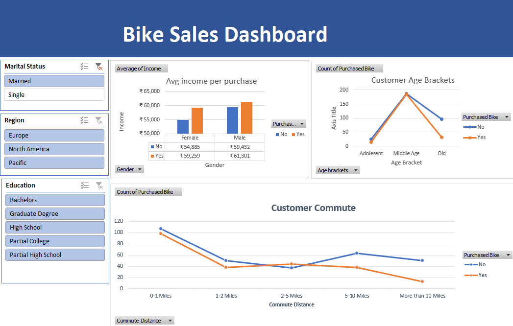

# 📊 Excel Sales Dashboard Project

This project is a dynamic and interactive **Sales Dashboard** built using **Microsoft Excel**.  
It visualizes key sales metrics using Pivot Tables, Pivot Charts, and Slicers to allow users to filter and explore the data easily.

---

---

## 🚀 Features

- ✅ Region-wise and category-wise sales breakdown  
- ✅ Interactive filtering using slicers  
- ✅ Clean data visualization using pivot charts  
- ✅ Simple and intuitive dashboard layout  

---

## 🛠 Tools Used

- Microsoft Excel  
- Pivot Tables  
- Pivot Charts  
- Slicers  
- Data Formatting

---

## 📂 Project Files

- `SalesDashboard.xlsx` → The main Excel dashboard file  
- `dashboard.png` → Screenshot of the dashboard

---

## 👩‍💻 Author

**Madhumitha Sri Murali**

🔗 [LinkedIn](https://www.linkedin.com/in/your-profile) *(replace this with your actual LinkedIn profile)*  
📧 Reach me at: your.email@example.com *(optional)*

---

## ⭐️ Show Your Support

If you liked this project or found it helpful, please consider giving it a ⭐️ on GitHub!

